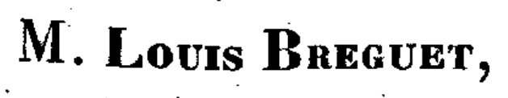
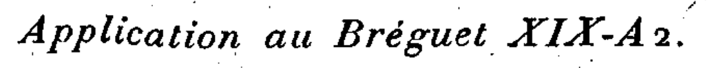

!!! info

    The relation describing the specific air range of an aircraft in cruise can be adapted to 
    calculate the fuel required for a given range $R$. The governing equation for the range is:

    $$
    R = \frac{1}{g} \int_{m_2}^{m_1} \frac{V\cdot L/D}{TSFC \cdot m} \text{d}m
    $$

    Depending on which variables are assumed constant during the flight, different analytical solutions 
    to the integral can be derived:

    | Variables assumed Constant | Variables allowed to Vary | Additional Assumptions | Solution | Function |
    |----------------------------|---------------------------|------------------------|----------|----------|
    | $TSFC$   $L/D$   $V$ | $m$ | none | _"Breguet range equation (climb-cruise)"_ | [`calculate_fuel_consumption_breguet`][jetfuelburn.rangeequation.calculate_fuel_consumption_breguet]   [`calculate_fuel_consumption_breguet_improved`][jetfuelburn.rangeequation.calculate_fuel_consumption_breguet_improved] |
    | $TSFC$   $h$   $V$ | $m$   $L/D$ | low-speed drag polar applies $C_D = C_{D_0} + KC_L^2$ | _"arctan solution (step-climb)"_ | [`calculate_fuel_consumption_stepclimb_arctan`][jetfuelburn.rangeequation.calculate_fuel_consumption_stepclimb_arctan] |
    | $TSFC$   $h$   $V$ | $m$   $L/D$ | none | _"numerical solution (step-climb)"_ | [`calculate_fuel_consumption_stepclimb_integration`][jetfuelburn.rangeequation.calculate_fuel_consumption_stepclimb_integration] |

    !!! note "References"
        Section 13.2 in Young, T. M. (2018).
        Performance of the Jet Transport Airplane (Section 13.7.3 "Fuel Required for Specified Range"). 
        _John Wiley & Sons_. doi:[10.1002/9781118534786](https://doi.org/10.1002/9781118534786)

    Note also that some authors spell "Breguet" as "Bréguet" (with accent on the "e"). This is not limited to non-French speakers. 
    Even in his original 1923 publication ["Calcul du Poids de Combustible Consummé par un Avion en vol Ascendant"](https://fr.wikisource.org/wiki/Livre:Comptes_rendus_hebdomadaires_des_séances_de_l’Académie_des_sciences,_tome_177,_1923.djvu)
    , Breguet's name is spelled **without** an accent: 

    { width="300" }

    But in the same publication, an aircraft manufactured by his company is spelled **with** accent:

    { width="300" }

::: jetfuelburn.rangeequation