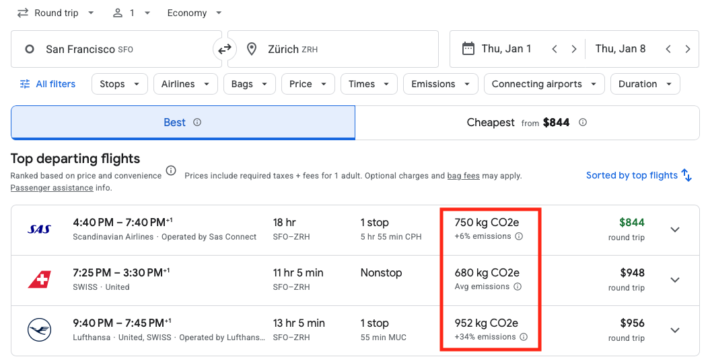

# Statistics Models (External)

## Travel Impact Model (Google)

The Google Travel Impact Model (TIM) estimates per-passenger flight emissions using aircraft fuel-burn data from the European Environment Agency’s Tier 3 aviation methodology. It calculates total fuel consumption by aircraft type and flight distance (adjusted for typical routing inefficiencies), converts it to CO₂-equivalent using life-cycle (Well-to-Wake) factors, and allocates emissions between passengers and cargo according to load and cabin class.

This model is integrated into the Google Flights interface and displays the CO2e values to users searching for flight options. See screenshot below:

*Example of CO₂ emissions displayed in Google Flights search results.*

!!! note
    The Travel Impact Model in Google Flights only works for flights in the future.

!!! reference "References"
    - [Official Website](http://www.travelimpactmodel.org/)
    - [GitHub Repository](https://github.com/google/travel-impact-model) - Detailed documentation and implementation
