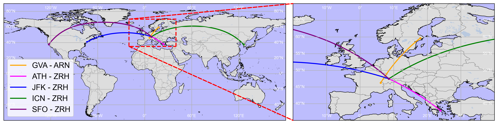

# Summary

`jetfuelburn` is a Python package that implements different methods for calculating the fuel burn of commercial passenger aircraft. It is designed to be used in the context of environmental impact assessment of air travel, aircraft performance analysis and optimisation. It supports calculations in physical units, allowing for quick conversion between imperial and metric units and dimensionality checks of function inputs. It is lightweight (<40kB packaged) and has only a single dependency (`pint`), therefore allowing for easy integration into WebAssembly kernels for interactive use in the browser. The package is open-source and distributed under a permissive MIT license. Interactive documentation is available, which allows users to compute fuel burn directly in the browser without the need to install the package locally.

# Statement of Need

The environmental assessment of air travel has received increasing attention in the context of efforts to decarbonize transportation. In this context, life-cycle assessment has emerged as the primary method used to evaluate the magnitude of environmental burdens [@keiser2023life]. In air travel specifically, it has been shown that _"The most important life sequence is the use sequence, which makes up over 99\% of emission for every aircraft."_ [@jakovljevic2018carbon, P.865]. Robust methods for computing two key parameters are therefore central to any reliable evaluation of the environmental impact of air travel: The fuel burn of the aircraft itself and the environmental burdens associated with fuel production.

Aerospace engineering researchers have proposed numerous methods for estimating commercial aircraft fuel burn, yet few are implemented in accessible, lightweight Python packages. Sun’s 2022 OpenAP package [@sun2022openap] is a standout, offering an innovative and user-friendly solution for fuel burn modeling. However, there is still no tool for comparative analysis of different models. The `jetfuelburn` package fills this gap as the first comprehensive Python package for comparing different aircraft fuel burn models from peer-reviewed publications. Tailored for environmental impact assessments, aircraft performance analysis, and optimization, it enhances existing calculators.

!(_media/airbus.png){height="2cm"}

\clearpage

# Example Use Case

{height="5cm"}

![Comparison of for the routes shown in adapted from [@weinold2025csfm] \label{fig:comparison}](_media/fuel_calc_comparison.svg){height="5cm"}

\clearpage

# Fuel Calculation Model Categories

The `jetfuelburn` package includes different methods for calculating fuel burn of commercial aircraft. These methods can be broadly categorized into four groups:

## Payload/Range Diagrams

As an initial estimate, the fuel burn of aircraft can be "read off" payload/range diagrams directly [@burzlaff2017aircraft]. The `jetfuelburn` package includes a dedicated method for this purpose.

## Range Equation

If some basic aircraft performance parameters are known, the Breguet range equation is a good model for estimating fuel consumption in cruise [@young2017performance, Sec. 13.7.3]. The `jetfuelburn` package includes a dedicated method this purpose.

## Reduced Order Models

If access to propriatary aircraft performance simulation software is available, fuel burn for specific aircraft missions can be simulated with high resolution. However, these simulations can be computationally expensive. Reduced order models instead use regression to extract a simplified model from a large set of high resolution simulation results. While the simulations may include many aircraft and mission parameters, reduced order models only require a few key parameter, such as payload and range. Publications implemented in the initial version of `jetfuelburn` include [@young2017performance; @dray2019aim2015; @seymour2020fuel; @yanto2017efficient; @lee2010closed].

## Statistical Models

If only a statistical average of fuel burn per passenger-kilometer or ton-kilometer is required, data from the US Department of Transportation (DOT) can be used ("Form 41, Schedule T-100, Table T2"). The `jetfuelburn` package includes a method for this purpose.

# Auxiliary Functions

The `jetfuelburn` package includes helper functions for basic problems in atmospheric physics, such as computation of airspeed from mach number based on ambient pressure. In addition, the package includes a module for the allocation of fuel burn to different cabin classes (economy, business, etc.) according to the current approach of both [IATA]((https://web.archive.org/web/20230526103741/https://www.iata.org/contentassets/139d686fa8f34c4ba7a41f7ba3e026e7/iata-rp-1726_passenger-co2.pdf)) and [ICAO]((https://web.archive.org/web/20240826103513/https://applications.icao.int/icec/Methodology%20ICAO%20Carbon%20Emissions%20Calculator_v13_Final.pdf)).

# Interactive Documentation

The package documentation allows users to compute fuel burn directly in the browser, without the need to install the package locally. This is achieved through the use of a [Pyodide](https://pyodide.org/en/stable/) Web Assembly Python kernel. The interactive documentation is available at [jetfuelburn.readthedocs.io](https://jetfuelburn.readthedocs.io).

# Acknowledgements

This work has been supported by the Swiss Innovation Agency Innosuisse in the context of the WISER flagship project (PFFS-21-72). In addition, Michael P. Weinold gratefully acknowledges the support of the Swiss Study Foundation.

# References